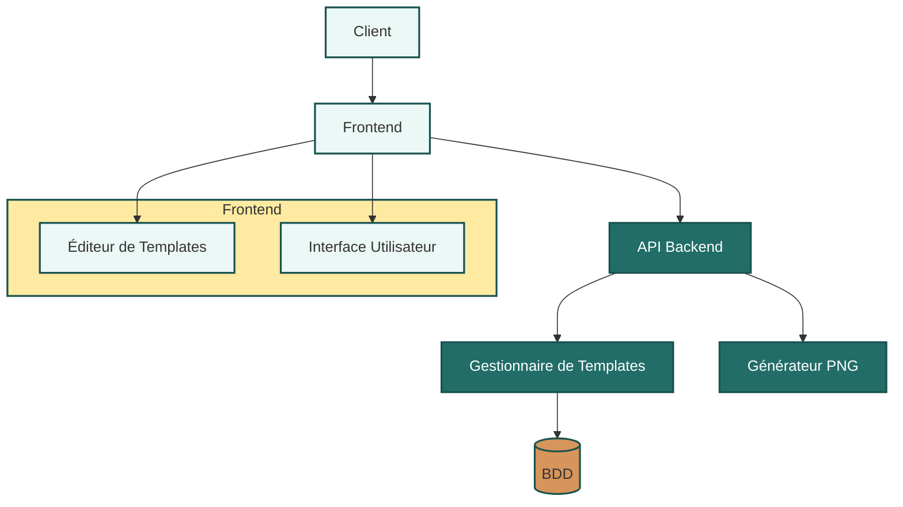

# Architecture globale

## Diagramme d'architecture globale

## Description des composants principaux de MyVectorCanvas

### 1. Frontend

#### 1.1 Interface Utilisateur
- **Fonction** : Point d'entrée principal pour les utilisateurs de l'application.
- **Caractéristiques** :
  - Interface intuitive et conviviale accessible via un navigateur web.
  - Permet la navigation entre les différentes fonctionnalités de l'application.
  - Affiche les templates disponibles et les projets en cours.

#### 1.2 Éditeur de Templates
- **Fonction** : Outil principal pour la création et la modification des templates vectoriels.
- **Caractéristiques** :
  - Interface de design graphique complète intégrée au navigateur.
  - Permet la définition des dimensions et du nombre de couleurs (2, 3, 4 ou plus).
  - Intègre des outils pour ajouter et modifier du texte, des tableaux, des QR codes, et des images.
  - Offre des formulaires dynamiques pour la personnalisation des templates.

### 2. Backend

#### 2.1 API Backend
- **Fonction** : Gère les communications entre le frontend et les services backend.
- **Caractéristiques** :
  - Expose des endpoints RESTful pour la récupération des templates et de leurs éléments associés.
  - Coordonne les interactions entre les différents services backend.

#### 2.2 Gestionnaire de Templates
- **Fonction** : Responsable de la logique métier liée à la gestion des templates.
- **Caractéristiques** :
  - Crée, lit, met à jour et supprime les templates dans la base de données.
  - Valide les modifications apportées aux templates.
  - Gère les versions des templates.

#### 2.3 Générateur PNG
- **Fonction** : Responsable de la création des images finales à partir des templates personnalisés.
- **Caractéristiques** :
  - Convertit les designs vectoriels en images PNG de haute qualité.
  - Gère différentes résolutions et formats d'export.
  - Optimise les images pour différents usages (web, impression, etc.).

### 3. Bases de données

#### 3.1 BDD
- **Fonction** : Stocke tous les templates et leurs éléments associés.
- **Caractéristiques** :
  - Conserve les métadonnées des templates (dimensions, nombre de couleurs, etc.).
  - Stocke la structure vectorielle des templates.
  - Permet une récupération rapide des templates pour l'édition.

Cette architecture modulaire permet à MyVectorCanvas d'offrir une solution complète et flexible pour la création et la gestion de templates d'images vectorielles, tout en assurant une expérience utilisateur fluide et intuitive.