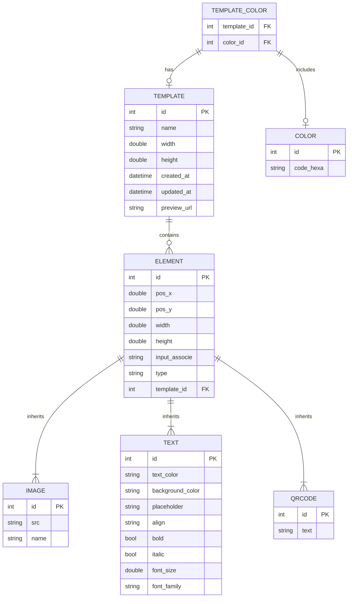

# Modèle de Données - MyVectorCanvas

Le modèle de données de l'application MyVectorCanvas est conçu pour stocker les informations relatives aux templates, éléments, couleurs, images, textes, et QR codes utilisés dans la création de designs personnalisés. Voici un aperçu des entités principales et de leurs relations :

